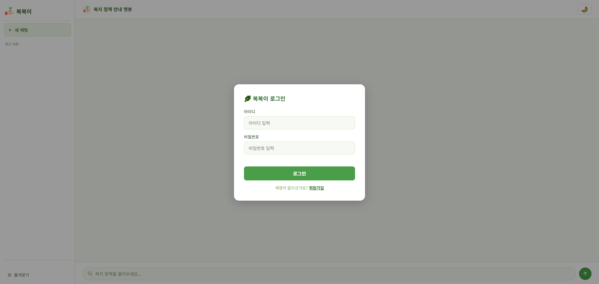
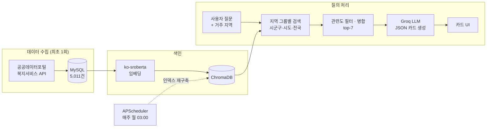

# 복복이 (WelBot) — 복지 정책 안내 AI 챗봇

> 공공데이터 **5,011건**의 중앙부처·지자체 복지 정책을 벡터 DB로 검색하고, LLM이 사용자 상황과 거주 지역에 맞는 정책을 **카드 형태**로 추천하는 RAG 챗봇

<p align="center">
  
  
</p>

## 팀 구성

| 이름 | 담당 |
| --- | --- |
| **허찬** | 백엔드(Flask) · DB 설계(MySQL) · 공공데이터 API 수집 파이프라인 · RAG 검색(임베딩 · ChromaDB) · LLM 연동 및 프롬프트 설계 |
| **임도현** | 프론트엔드 UI(채팅 · 카드 · 다크모드 · 반응형) · LLM 모델 선정 및 API 환경 구성 · 발표 자료 제작 |

> 팀 프로젝트 종료 후, 허찬이 검색 품질 · 응답 안정성 · 비용 최적화를 위한 [개인 개선 작업](#프로젝트-이후-개인-개선-허찬)을 진행했습니다.

## 핵심 포인트

| | 내용 |
| --- | --- |
| **RAG 파이프라인 직접 구현** | 공공데이터 API 수집 → MySQL 적재 → 한국어 임베딩(`ko-sroberta`) → ChromaDB 검색 → LLM 근거 기반 답변까지 전 과정 구현 |
| **지역 맞춤 검색 설계** | 시군구 / 시도 / 전국 3개 그룹 할당 + 거리 기반 관련도 필터로, 신청 불가능한 타 지역 정책은 제외하고 전국 정책 누락 문제 해결 |
| **LLM 응답 안정화** | 추론 모델의 토큰 한도로 JSON 응답이 잘리던 문제를 원인 분석 후 해결 → 카드 응답 정상화 |
| **비용(토큰) 최적화** | 검색 결과 수·프롬프트 축약으로 질문당 토큰 **약 4,150 → 3,300 (약 20% 절감)** |
| **할루시네이션 감소** | 지역·기관·신청방법 메타데이터를 컨텍스트에 명시해 LLM이 정보를 추측하지 않도록 개선 |
| **운영 고려** | 주간 인덱스 재구축 배치, API Rate Limit 재시도, 환경변수 기반 비밀 정보 분리 |

## 아키텍처



## 프로젝트 이후 개인 개선 (허찬)

팀 프로젝트 결과물을 직접 운영·테스트하며 발견한 문제를 원인 분석부터 개선까지 진행했습니다.

### 1. 지역 필터 때문에 더 적합한 전국 정책이 누락되던 문제

- **문제** — 사용자 시/도로 먼저 10건을 검색하고, 10건이 다 차면 전국 정책은 아예 검색하지 않는 구조였습니다. 서울 거주자가 "노인 의료비"를 물으면 질문과 더 가까운 전국 정책(거리 58)이 서울 정책(거리 73)에 밀려 빠졌습니다. 또한 같은 시/도의 **다른 구 전용 정책**(신청 불가)이 함께 노출되었습니다.
- **해결** — 후보를 `내 시군구 / 시도 공통 / 전국` 세 그룹으로 나눠 각각 검색하고, 그룹별 최소 할당량(3/2/2)을 채운 뒤 남은 자리는 거리순으로 채우도록 재설계했습니다. 최상위 결과 거리의 1.5배를 넘는 결과는 관련 없는 정책으로 보고 제외하되, 최소 5건은 보장합니다. 다른 시군구 전용 정책은 후보에서 제외했습니다.
- **결과** — 강남구 사용자의 "청년 월세 지원" 질문에서 전국 단위 핵심 정책인 **청년월세 지원사업**이 새로 검색되고, 타 구 정책은 제외되었습니다.

### 2. LLM 응답이 잘려 카드 대신 JSON 원문이 노출되던 문제

- **문제** — 화면에 카드 대신 깨진 JSON 문자열이 그대로 표시되었습니다.
- **원인** — API 응답의 `finish_reason`이 `length`였습니다. 사용 모델(`gpt-oss-20b`)은 추론 모델이라 **내부 추론 토큰도 `max_tokens`(1,024)에 포함**되어, 실제 답변을 쓰는 도중 한도에 도달했습니다.
- **해결** — `reasoning_effort: low`로 추론량을 줄이고 `max_tokens`를 2,048로 조정했습니다.
- **결과** — 출력 토큰 1,024(잘림) → 약 600~800(정상 종료). 테스트 질문 모두 카드로 정상 렌더링되었습니다.

### 3. LLM이 정책의 지역·기관을 추측해서 채우던 문제

- **문제** — 전국 정책인 "청년월세 지원사업"이 카드에 "서울특별시"로 표시되었습니다.
- **원인** — LLM에 전달하는 컨텍스트에 지역·기관·신청방법 정보가 없어, 모델이 사용자 지역을 보고 추측했습니다.
- **해결** — 검색된 메타데이터의 `지역 / 기관 / 신청방법 / 온라인신청 여부`를 컨텍스트에 명시하고, 프롬프트에서 "필드 값을 그대로 사용"하도록 지시했습니다.
- **결과** — 카드의 지역·기관이 실제 데이터와 일치하게 표시되었습니다.

### 4. 토큰 사용량 최적화

정보를 추가하면서 늘어난 토큰을 검색 결과 수(top-k 10 → 7)와 시스템 프롬프트 축약으로 줄였습니다. 답변 품질(카드 2~3개, 지역 정확도)은 유지됐습니다.

| 단계 | 질문당 토큰 | 비고 |
| --- | --- | --- |
| 최초 | 약 3,600 | 출력이 잘려 응답 실패 |
| 응답 안정화 + 메타데이터 추가 | 약 4,150 | 정상 응답 |
| 최적화 후 | **약 3,300** | 정상 응답, 약 20% 절감 |

> Groq 무료 티어(분당 8,000 토큰) 환경에서 1회 질문 비용을 낮춰 Rate Limit 여유를 확보했습니다.

### 5. 자유 입력 지역명으로 인한 매칭 실패

- **문제** — 시군구를 자유 입력으로 받아 "강남"처럼 입력하면 데이터의 "강남구"와 매칭되지 않았습니다.
- **해결** — DB의 정책 데이터에서 시도별 시군구 목록을 추출해 `/regions` API로 제공하고, 회원가입·지역 수정 화면을 **선택형 드롭다운**으로 변경했습니다. 기존에 자유 입력으로 저장된 회원도 접미사(시/군/구) 보정으로 매칭되도록 호환성을 유지했습니다.

## 주요 기능

- **RAG 기반 정책 검색** — `jhgan/ko-sroberta-multitask` 임베딩 + ChromaDB 벡터 검색
- **지역 맞춤 추천** — 시군구·시도·전국 그룹별 검색 후 병합 ("전국/타지역" 키워드 입력 시 전체 검색)
- **LLM 카드 답변** — 검색 결과만 근거로 JSON 카드 생성, 복지로 신청 링크 제공, 최근 대화 맥락 반영
- **회원 / 세션 관리** — 회원가입, 로그인, 지역 정보 수정, 대화 기록 저장
- **관리자 페이지** — 회원 목록 조회 및 탈퇴 처리
- **자동 갱신 배치** — APScheduler로 매주 월요일 03:00 벡터 인덱스 재구축
- **UI** — 즐겨찾기, 다크 모드, 모바일 반응형

## 기술 스택

| 구분 | 사용 기술 |
| --- | --- |
| Backend | Python 3.12, Flask, APScheduler |
| Database | MySQL / MariaDB, ChromaDB (Vector DB) |
| AI | Sentence-Transformers (`ko-sroberta-multitask`), Groq API (`openai/gpt-oss-20b`) |
| Frontend | HTML, CSS, Vanilla JS |
| Data | 공공데이터포털 중앙부처·지자체 복지서비스 API |

## 프로젝트 구조

```
├── app.py            # Flask 서버 · 라우팅 · 주간 배치 스케줄러
├── db.py             # MySQL 접근 계층 (회원, 대화 기록, 지역 목록)
├── rag.py            # 임베딩 · ChromaDB 인덱스 구축 · 지역 그룹별 검색
├── llm.py            # Groq API 호출 · 프롬프트 · JSON 파싱 · 재시도
├── config.py         # 환경변수(.env) 로드
├── importPublic.py   # 중앙부처 복지서비스 데이터 수집
├── importLocal.py    # 지자체 복지서비스 데이터 수집
├── check.py          # Groq 사용 가능 모델 확인용 스크립트
├── schema.sql        # DB 테이블 스키마
├── index.html · script.js · style.css · media.css
└── .env.example      # 환경변수 템플릿
```

## 실행 방법

```bash
# 1. 가상환경 & 패키지 설치
python -m venv venv
venv\Scripts\activate          # macOS/Linux: source venv/bin/activate
pip install -r requirements.txt

# 2. 환경변수 설정
cp .env.example .env           # 이후 .env 에 DB 정보와 API 키 입력

# 3. DB 스키마 생성
mysql -u root -p < schema.sql

# 4. 복지 데이터 수집 (최초 1회, 공공데이터포털 API 키 필요)
python importPublic.py
python importLocal.py

# 5. 서버 실행 (최초 실행 시 벡터 인덱스 자동 생성)
python app.py
```

브라우저에서 `http://localhost:5000` 접속.

## 환경변수

| 이름 | 설명 |
| --- | --- |
| `DB_HOST` / `DB_PORT` / `DB_USER` / `DB_PASSWORD` / `DB_NAME` | MySQL 접속 정보 |
| `GROQ_API_KEY` | [Groq](https://console.groq.com/keys) API 키 |
| `WELFARE_API_KEY` | [공공데이터포털](https://www.data.go.kr) 복지서비스 API 인증키 |
| `FLASK_SECRET_KEY` | Flask 세션 서명 키 |
| `FLASK_DEBUG` | `true` 시 디버그 모드 |

## 향후 개선 계획

- 비밀번호 해시 저장 (`werkzeug.security`) 적용
- 공공데이터 수집 단계를 주간 배치에 통합해 데이터 자동 최신화
- 검색 품질 정량 평가 (질문-정답 세트 기반 Recall@k 측정)
