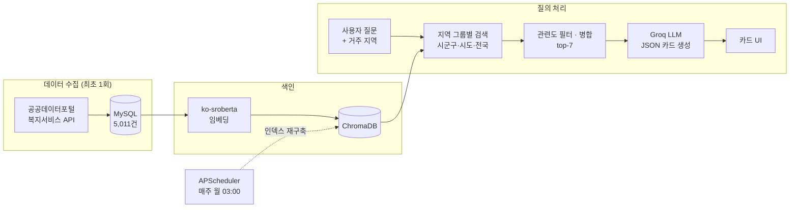

# 복복이 (WelBot) — 복지 정책 안내 AI 챗봇

> 공공데이터 **5,011건**의 중앙부처·지자체 복지 정책을 벡터 DB로 검색하고, LLM이 사용자 상황과 거주 지역에 맞는 정책을 **카드 형태**로 추천하는 RAG 챗봇

<p align="center">
  
  
</p>

## 팀 구성

| 이름 | 담당 |
| --- | --- |
| **허찬** | 백엔드(Flask) · DB 설계(MySQL) · 공공데이터 API 수집 파이프라인 · RAG 검색(임베딩 · ChromaDB) · LLM 연동 및 프롬프트 설계 |
| **임도현** | 프론트엔드 UI(채팅 · 카드 · 다크모드 · 반응형) · LLM 모델 선정 및 API 환경 구성 · 발표 자료 제작 |

> 팀 프로젝트 종료 후, 허찬이 검색 품질 · 응답 안정성 · 비용 최적화를 위한 [개인 개선 작업](#프로젝트-이후-개인-개선-허찬)을 진행했습니다.

## 핵심 포인트

| | 내용 |
| --- | --- |
| **RAG 파이프라인 직접 구현** | 공공데이터 API 수집 → MySQL 적재 → 한국어 임베딩(`ko-sroberta`) → ChromaDB 검색 → LLM 근거 기반 답변까지 전 과정 구현 |
| **지역 맞춤 검색 설계** | 시군구 / 시도 / 전국 3개 그룹 할당 + 거리 기반 관련도 필터로, 신청 불가능한 타 지역 정책은 제외하고 전국 정책 누락 문제 해결 |
| **LLM 응답 안정화** | 추론 모델의 토큰 한도로 JSON 응답이 잘리던 문제를 원인 분석 후 해결 → 카드 응답 정상화 |
| **비용(토큰) 최적화** | 검색 결과 수·프롬프트 축약으로 질문당 토큰 **약 4,150 → 3,300 (약 20% 절감)** |
| **할루시네이션 감소** | 지역·기관·신청방법 메타데이터를 컨텍스트에 명시해 LLM이 정보를 추측하지 않도록 개선 |
| **운영 고려** | 주간 인덱스 재구축 배치, API Rate Limit 재시도, 환경변수 기반 비밀 정보 분리, `docker compose` 한 번으로 실행 환경 구성 |

## 아키텍처



## 프로젝트 이후 개인 개선 (허찬)

팀 프로젝트 이후 직접 테스트하며 발견한 문제를 원인 분석부터 개선까지 진행했습니다.

**1. 지역 검색 재설계** — 전국 정책 누락 · 타 지역 정책 노출
- 문제: 시/도 결과가 10건을 채우면 전국 정책을 검색하지 않아, 질문과 더 가까운 전국 정책(거리 58)이 서울 정책(거리 73)에 밀려 빠지고, 신청 불가한 다른 구 정책은 노출됨
- 해결: `시군구 / 시도 / 전국` 그룹별 할당(3/2/2) + 거리 기반 관련도 필터, 타 시군구 정책 제외
- 결과: "청년 월세" 질문에 전국 핵심 정책 **청년월세 지원사업**이 새로 검색됨

**2. LLM 응답 잘림 해결** — 카드 대신 깨진 JSON 노출
- 원인: 추론 모델(`gpt-oss-20b`)의 내부 추론 토큰이 `max_tokens`(1,024)를 소진 (`finish_reason: length`)
- 해결: `reasoning_effort: low` 적용, `max_tokens` 2,048로 조정 → 정상 종료

**3. 할루시네이션 감소** — 전국 정책이 "서울특별시"로 표시
- 원인: 컨텍스트에 지역 · 기관 정보가 없어 LLM이 추측
- 해결: 지역 · 기관 · 신청방법 · 온라인신청 메타데이터를 컨텍스트에 명시

**4. 토큰 최적화** — top-k 10 → 7, 시스템 프롬프트 축약
- 질문당 토큰 **약 4,150 → 3,300 (약 20% 절감)**, 답변 품질 유지

**5. 지역 입력 개선** — "강남" 입력 시 "강남구"와 매칭 실패
- 해결: DB 기반 시군구 목록 API(`/regions`) + 선택형 드롭다운, 기존 자유 입력값도 호환

## 주요 기능

- **RAG 기반 정책 검색** — `jhgan/ko-sroberta-multitask` 임베딩 + ChromaDB 벡터 검색
- **지역 맞춤 추천** — 시군구·시도·전국 그룹별 검색 후 병합 ("전국/타지역" 키워드 입력 시 전체 검색)
- **LLM 카드 답변** — 검색 결과만 근거로 JSON 카드 생성, 복지로 신청 링크 제공, 최근 대화 맥락 반영
- **회원 / 세션 관리** — 회원가입, 로그인, 지역 정보 수정, 대화 기록 저장
- **관리자 페이지** — 회원 목록 조회 및 탈퇴 처리
- **자동 갱신 배치** — APScheduler로 매주 월요일 03:00 벡터 인덱스 재구축
- **UI** — 즐겨찾기, 다크 모드, 모바일 반응형

## 기술 스택

| 구분 | 사용 기술 |
| --- | --- |
| Backend | Python 3.12, Flask, APScheduler |
| Infra | Docker, Docker Compose |
| Database | MySQL / MariaDB, ChromaDB (Vector DB) |
| AI | Sentence-Transformers (`ko-sroberta-multitask`), Groq API (`openai/gpt-oss-20b`) |
| Frontend | HTML, CSS, Vanilla JS |
| Data | 공공데이터포털 중앙부처·지자체 복지서비스 API |

## 프로젝트 구조

```
├── app.py            # Flask 서버 · 라우팅 · 주간 배치 스케줄러
├── db.py             # MySQL 접근 계층 (회원, 대화 기록, 지역 목록)
├── rag.py            # 임베딩 · ChromaDB 인덱스 구축 · 지역 그룹별 검색
├── llm.py            # Groq API 호출 · 프롬프트 · JSON 파싱 · 재시도
├── config.py         # 환경변수(.env) 로드
├── importPublic.py   # 중앙부처 복지서비스 데이터 수집
├── importLocal.py    # 지자체 복지서비스 데이터 수집
├── check.py          # Groq 사용 가능 모델 확인용 스크립트
├── schema.sql        # DB 테이블 스키마
├── seed.sql          # 복지 정책 데이터 5,011건 (2026년 6월 수집, 회원 정보 미포함)
├── Dockerfile · docker-compose.yml
├── index.html · script.js · style.css · media.css
└── .env.example      # 환경변수 템플릿
```

## 실행 방법

정책 데이터 5,011건(`seed.sql`)이 저장소에 포함되어 있어 **공공데이터 API 키 없이** 바로 실행할 수 있습니다. 필요한 것은 [Groq API 키](https://console.groq.com/keys)(무료)뿐입니다.

### 방법 1. Docker (권장)

```bash
cp .env.example .env           # .env 에 GROQ_API_KEY 입력
docker compose up --build
```

- MariaDB 컨테이너가 `schema.sql` → `seed.sql` 순서로 DB를 자동 구성합니다.
- 최초 실행 시 벡터 인덱스를 생성하며 약 2~3분 소요됩니다. 이후 실행에서는 볼륨에 저장된 인덱스를 재사용합니다.
- 브라우저에서 `http://localhost:5000` 접속

### 방법 2. 로컬 실행

```bash
# 1. 가상환경 & 패키지 설치
python -m venv venv
venv\Scripts\activate          # macOS/Linux: source venv/bin/activate
pip install -r requirements.txt

# 2. 환경변수 설정
cp .env.example .env           # .env 에 DB 접속 정보와 GROQ_API_KEY 입력

# 3. DB 스키마 생성 및 정책 데이터 적재
mysql -u root -p < schema.sql
mysql -u root -p < seed.sql

# 4. 서버 실행 (최초 실행 시 벡터 인덱스 자동 생성)
python app.py
```

> 데이터를 최신으로 다시 수집하려면 `.env` 에 `WELFARE_API_KEY` 를 입력하고 `python importPublic.py`, `python importLocal.py` 를 실행합니다.

## 환경변수

| 이름 | 설명 |
| --- | --- |
| `DB_HOST` / `DB_PORT` / `DB_USER` / `DB_PASSWORD` / `DB_NAME` | MySQL 접속 정보 |
| `GROQ_API_KEY` | [Groq](https://console.groq.com/keys) API 키 |
| `WELFARE_API_KEY` | [공공데이터포털](https://www.data.go.kr) 복지서비스 API 인증키 |
| `FLASK_SECRET_KEY` | Flask 세션 서명 키 |
| `FLASK_DEBUG` | `true` 시 디버그 모드 |

## 향후 개선 계획

- 비밀번호 해시 저장 (`werkzeug.security`) 적용
- 공공데이터 수집 단계를 주간 배치에 통합해 데이터 자동 최신화
- 검색 품질 정량 평가 (질문-정답 세트 기반 Recall@k 측정)
